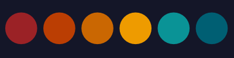

  
  <h2 align="center">High Flyer Theme 🪁</h2>

A Visual Studio Code theme for all highflyers out there.

  

The font in the preview image is Fira Code, [available here](https://github.com/tonsky/FiraCode).

## Installation

1.  Install [Visual Studio Code](https://code.visualstudio.com/)
2.  Launch Visual Studio Code
3.  Choose **Extensions** from menu
4.  Search for `highflyer theme`
5.  Click **Install** to install it
